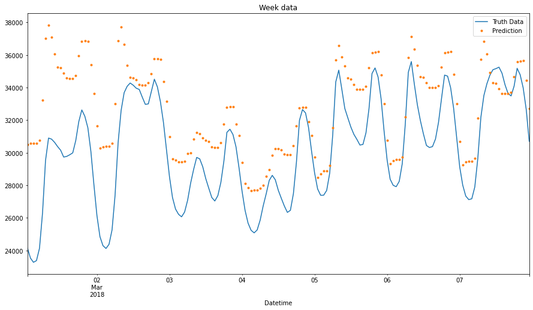

# Time Series Forecasting Project

This repository contains code and data for a time series forecasting project using Python. The project aims to predict future values of a time series dataset by training an XGBoost regressor.

## Folder Structure

- **data**: This folder contains the dataset used for time series forecasting. The main data file is "PJME_hourly.csv."

- **timeseries_forecasting.ipynb**: This notebook walks through the various steps of the time series forecasting project. 

- **Images**: Output Image is stored in this folder.

- **README.md**: This file, which provides an overview of the project and its folder structure.

## Project Overview

In this project, we perform the following tasks:

1. Data loading and preprocessing: We load the time series data from the "PJME_hourly.csv" file, set the index to datetime, and create additional features for time series forecasting.

2. Data visualization: We use Python libraries such as Matplotlib and Seaborn to visualize the time series data, the training and test splits, and various data patterns.

3. Model training: We build an XGBoost regressor for time series forecasting, using features created in the preprocessing step.

4. Feature importance: We analyze the feature importance of the XGBoost model to understand which features have the most impact on the predictions.

5. Forecasting: We make predictions on the test set and visualize the predicted values alongside the true values.

## Usage

You can explore the project by following the steps outlined in the "timeseries_forecasting.ipynb" notebook. This notebook provides a step-by-step guide to the entire time series forecasting process.

## Requirements

To run the code and notebooks in this project, you will need the following Python libraries and tools:

- pandas
- numpy
- matplotlib
- seaborn
- xgboost
- scikit-learn

You can install these libraries using `pip` or `conda`.

```bash
pip install pandas numpy matplotlib seaborn xgboost scikit-learn
